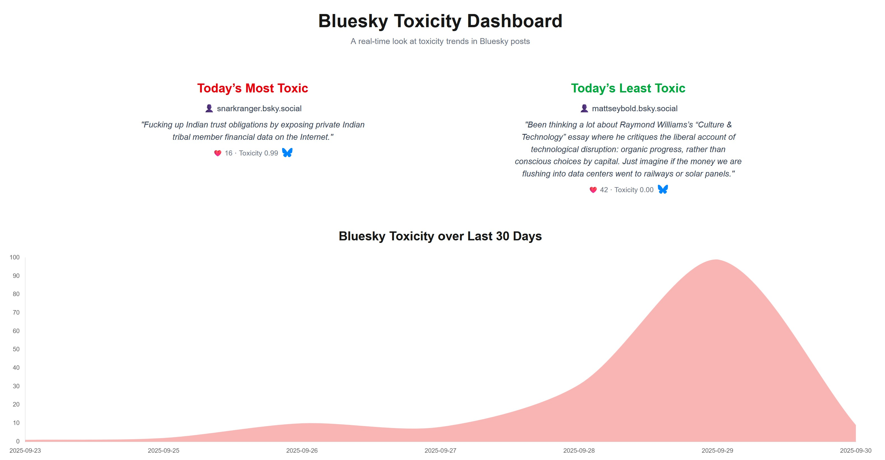
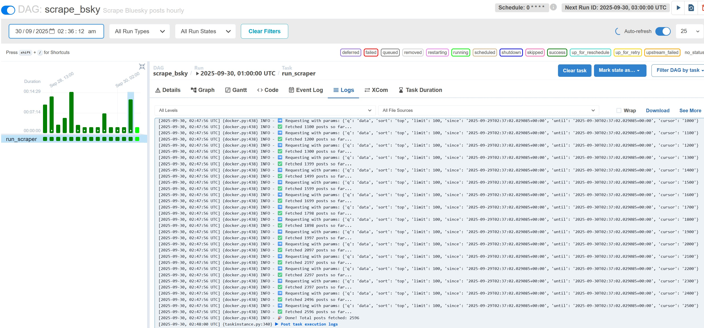

# 🌐 Bluesky Toxicity Classifier

A small full-stack project that tracks and classifies toxic posts on [Bluesky](https://bsky.app).  
It combines scraping, machine learning, and visualization into a real-time dashboard.

---

## ✨ Features
- **Scraper** – fetches posts from Bluesky using the public API  
- **Toxicity detection** – powered by [Detoxify](https://github.com/unitaryai/detoxify) from Unitary AI  
- **REST API** – Flask service for exposing data and stats  
- **Dashboard** – Next.js + Tailwind frontend showing leaderboards and trends  
- **Automation** – Apache Airflow DAGs for scheduled scraping  
- **Containerized** – fully Dockerized with `docker compose`

---

## 🏗️ Architecture
```
Postgres  ←→  Flask API (Gunicorn)  ←→  Next.js Frontend
   ↑
   └── Scraper (Detoxify model)
   
Airflow (Scheduler + Webserver) orchestrates periodic scraping
```

---

## 🚀 Getting Started

### 1. Clone the repo
```bash
git clone https://github.com/yourusername/bluesky-toxicity.git
cd bluesky-toxicity
```

### 2. Environment variables

Create a `.env` file at the project root:

```ini
# Bluesky
BLUESKY_IDENTIFIER=your-handle.bsky.social
BLUESKY_APP_PASSWORD=your-app-password

# Postgres
POSTGRES_USER=postgres
POSTGRES_PASSWORD=postgres
POSTGRES_DB=postgres

# API
DATABASE_URL=postgresql://postgres:postgres@db:5432/bluesky

# Airflow
AIRFLOW__WEBSERVER__SECRET_KEY=your-secret-key
AIRFLOW__CORE__FERNET_KEY=your-fernet-key
AIRFLOW__CORE__EXECUTOR=LocalExecutor
AIRFLOW__DATABASE__SQL_ALCHEMY_CONN=postgresql+psycopg2://postgres:postgres@db:5432/airflow
```

Create a separate `.env.local` inside `frontend/`:

```ini
# Next.js
NEXT_PUBLIC_API_URL=http://api:8000
```

### 3. Run with Docker
```bash
docker compose up -d --build
```

- Frontend: [http://localhost:3000](http://localhost:3000)  
- API: [http://localhost:8000](http://localhost:8000)  
- Airflow UI: [http://localhost:8080](http://localhost:8080)  

---

## 📊 Dashboard Preview


## Airflow UI
Airflow orchestrating the scraper tasks:


---

## 🛠️ Tech Stack
- **Backend**: Flask, Gunicorn  
- **ML Model**: Detoxify (PyTorch)  
- **Frontend**: Next.js, TailwindCSS  
- **Database**: PostgreSQL  
- **Scheduler**: Apache Airflow  
- **Infra**: Docker & Docker Compose  

---

## 🙌 Credits
- Toxicity classification by [Detoxify](https://github.com/unitaryai/detoxify) (Unitary AI)  
- Built with [Next.js](https://nextjs.org/) + [Flask](https://flask.palletsprojects.com/)  
- Created by **Isaac Ong**
