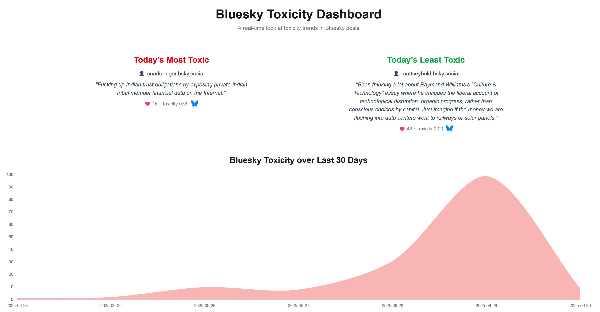
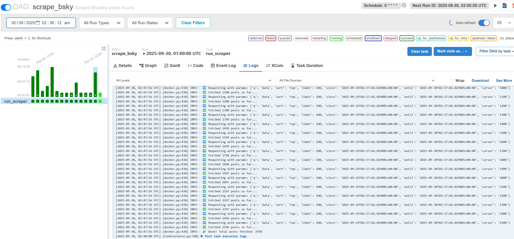

# Bluesky Toxicity Classifier

> A small full-stack project that tracks and classifies toxic posts on [Bluesky](https://bsky.app), combinomomg scraping, an ETL pipeline, machine learning and visualization into a dashboard.

<p align="center">
    <a href="https://blueskytoxicity.org">App</a> •
    <a href="LICENSE">License</a>
</p>

<p align="center">
  
  
  
  
  
  
</p>
---

## Features
- Scraper: fetches posts from Bluesky using the public API
- ETL pipeline: extract, transforms and loads posts and model scores into Postgres
- Toxicity detection: powered by [Detoxify](https://github.com/unitaryai/detoxify) from Unitary AI
- REST API: Flask service for exposing data and stats
- Dashboard: Next.js + Tailwind frontend showing leaderboards and trends
- Automation: Apache Airflow DAGs for scheduled scraping and ETL
- Containerized: fully Dockerized with `docker compose`
- Deployment: hosted at https://blueskytoxicity.org

---

## Architecture
```
           Airflow (Scheduler + Webserver)
                 │           │
                 │           └── Triggers ETL jobs
                 ▼
Scraper ──► Transform/Score (Detoxify) ──► Postgres ◄── Flask API (Gunicorn) ◄── Next.js Frontend
                           ▲
                           └────────────── ETL load and periodic backfills
```

---

## Getting Started

### 1. Clone the repo
```bash
git clone https://github.com/IZO-Ong/Bluesky-Toxicity.git
cd Bluesky-Toxicity
```

### 2. Environment variables

Create a `.env` file at the project root:

```ini
# Bluesky
BLUESKY_IDENTIFIER=your-handle.bsky.social
BLUESKY_APP_PASSWORD=your-app-password

# Postgres
POSTGRES_USER=postgres
POSTGRES_PASSWORD=postgres
POSTGRES_DB=postgres

# API
DATABASE_URL=postgresql://postgres:postgres@db:5432/bluesky

# Airflow
AIRFLOW__WEBSERVER__SECRET_KEY=your-secret-key
AIRFLOW__CORE__FERNET_KEY=your-fernet-key
AIRFLOW__CORE__EXECUTOR=LocalExecutor
AIRFLOW__DATABASE__SQL_ALCHEMY_CONN=postgresql+psycopg2://postgres:postgres@db:5432/airflow
```

Create a separate `.env.local` inside `frontend/`:

```ini
# Next.js
NEXT_PUBLIC_API_URL=http://api:8000
```

### 3. Run with Docker
```bash
docker compose up -d --build
```

- Frontend: http://localhost:3000
- API: http://localhost:8000
- Airflow UI: http://localhost:8080

---

## Dashboard Preview


## Airflow UI
Airflow orchestrating the scraper and ETL tasks:


---

## Tech Stack
- Backend: Flask, Gunicorn
- ML Model: Detoxify (PyTorch)
- Frontend: Next.js, TailwindCSS
- Database: PostgreSQL
- Scheduler/Orchestration: Apache Airflow
- Infra: Docker & Docker Compose

---

## Credits
- Toxicity classification by [Detoxify](https://github.com/unitaryai/detoxify) (Unitary AI)
- Built with [Next.js](https://nextjs.org/) and [Flask](https://flask.palletsprojects.com/)
- Created by Isaac Ong

---

## License
See [LICENSE](LICENSE).
